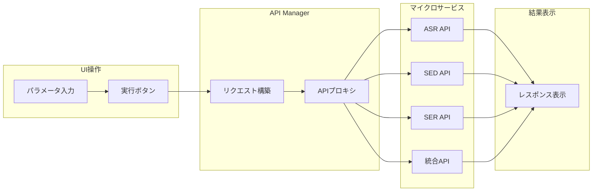
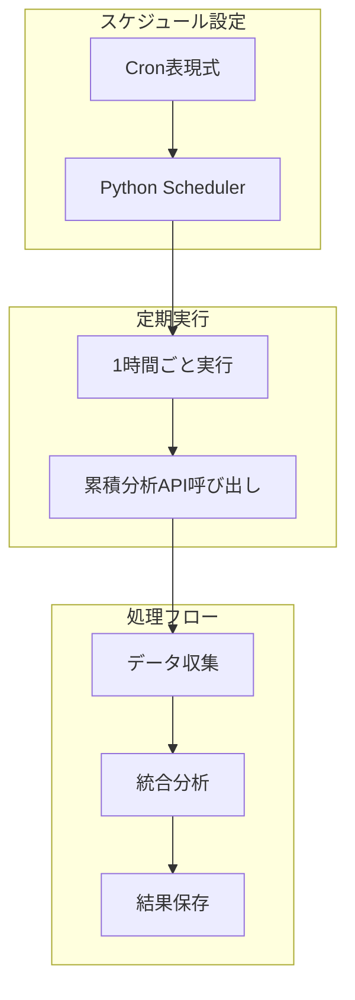

# WatchMe API Manager

## 📊 システム概要

API Managerは、WatchMeプラットフォームの各種マイクロサービス（音声解析・感情分析・行動分析など）を管理・実行するためのシステムです。

## 🏗️ システム構成

このプロジェクトは**2つの独立したコンポーネント**で構成されています：

### 1️⃣ **フロントエンド - 手動API実行UI**
- **役割**: 各種APIを手動で実行・テストするためのWebインターフェース
- **技術**: React + Vite
- **ポート**: 9001（開発）
- **機能**:
  - 各APIのパラメータ入力フォーム
  - API実行とレスポンス表示
  - 音声ファイル管理・再生
  - リアルタイム処理状況モニタリング

### 2️⃣ **バックエンド - Cronスケジューラーシステム**  
- **役割**: EC2サーバー上のcronジョブを管理し、定期的にAPIを自動実行
- **技術**: Python + Docker
- **場所**: EC2サーバー (`/etc/cron.d/watchme-scheduler`)
- **機能**:
  - 定期的なバッチ処理の自動実行
  - ダッシュボードサマリーの生成
  - スケジュール設定の管理

### 🌐 アクセス情報

| 環境 | URL | 用途 |
|------|-----|------|
| **本番環境** | https://api.hey-watch.me/manager | プロダクション運用 |
| **開発環境** | http://localhost:9001 | ローカル開発・テスト |
| **GitHub** | [hey-watchme/api-manager](https://github.com/hey-watchme/api-manager) | ソースコード |

---

## 🔄 API構成

### マイクロサービス一覧

| カテゴリ | サービス名 | コンテナ名 | ポート | エンドポイント | メソッド |
|---------|-----------|-----------|--------|---------------|---------|
| **ASR** | Azure ASR | `vibe-transcriber-v2` | 8013 | `/fetch-and-transcribe` | POST |
| **統合** | プロンプト生成 | `api_gen_prompt_mood_chart` | 8009 | `/generate-mood-prompt-supabase` | **GET** |
| **統合** | スコアリング | `api-gpt-v1` | 8002 | `/analyze-vibegraph-supabase` | POST |
| **SED** | 音響イベント検出 | `sed-api` | 8004 | `/fetch-and-process-paths` | POST |
| **SED** | 行動集計 | `api-sed-aggregator` | 8010 | `/analysis/sed` | POST |
| **SER** | 感情特徴抽出 | `opensmile-api` | 8011 | `/process/emotion-features` | POST |
| **SER** | 感情集計 | `opensmile-aggregator` | 8012 | `/analyze/opensmile-aggregator` | POST |

### データ処理パターン

| パターン | 入力形式 | 使用API | 説明 |
|---------|---------|---------|------|
| **ファイルベース** | `file_paths[]` | ASR, SED, SER | 個別ファイルを直接処理 |
| **デバイスベース** | `device_id + date` | 集計・統合API | デバイス単位で日次処理 |
| **タイムブロック** | `device_id + date + time_block` | ダッシュボード | 30分単位の詳細処理 |

---

## 📋 主要機能詳細

### 1️⃣ API実行管理機能



**特徴**:
- 全APIを統一UIから実行
- パラメータのバリデーション
- リアルタイムレスポンス表示
- エラーハンドリング

### 2️⃣ スケジューラー機能



## 📅 スケジューラー詳細

### 現在のスケジュール設定（EC2サーバー上のcron）

スケジューラーは `/etc/cron.d/watchme-scheduler` で管理され、Dockerコンテナ `watchme-scheduler-prod` 内で実行されます。

| ジョブ名 | 実行時刻 | API | エンドポイント | 処理タイプ | データ保存先 | ステータス |
|---------|---------|-----|---------------|-----------|------------|-----------|
| **ASR - Azure音声書き起こし** | 毎時10分 | azure-transcriber | `vibe-transcriber-v2:8013/fetch-and-transcribe` | ファイルベース | `transcriptions`テーブル | ⚠️ 停止中 |
| **ASR - プロンプト - 気分** | 毎時20分 | vibe-aggregator | `api_gen_prompt_mood_chart:8009/generate-mood-prompt-supabase` | デバイスベース | `vibe_whisper`テーブル | ⚠️ 停止中 |
| **ASR - ChatGPT分析 - 気分** | 3時間ごと30分 | vibe-scorer | `api-gpt-v1:8002/analyze-vibegraph-supabase` | デバイスベース | `vibegraph`テーブル | ⚠️ 停止中 |
| **SED - 行動特徴抽出(AST)** | 毎時10分 | behavior-features | `ast-api:8017/fetch-and-process-paths` | ファイルベース | `behavior_yamnet`テーブル | ⚠️ 停止中 |
| **SED - 行動集計** | 毎時20分 | behavior-aggregator | `api-sed-aggregator:8010/analysis/sed` | デバイスベース | `behavior_daily_summary`テーブル | ⚠️ 停止中 |
| **SER - 感情特徴抽出(SUPERB)** | 毎時20分 | emotion-features | `superb-api:8018/process/emotion-features` | ファイルベース | `emotion_opensmile`テーブル | ⚠️ 停止中 |
| **SER - 感情集計** | 毎時30分 | emotion-aggregator | `opensmile-aggregator:8012/analyze/opensmile-aggregator` | デバイスベース | `emotion_daily_summary`テーブル | ⚠️ 停止中 |
| **プロンプト-タイムブロック** | 毎時40分 | timeblock-prompt | `api_gen_prompt_mood_chart:8009/generate-timeblock-prompt` | タイムブロック型 | `dashboard`テーブル | ⚠️ 停止中 |
| **ChatGPT分析-タイムブロック分** | 毎時50分 | timeblock-analysis | `api-gpt-v1:8002/analyze-timeblock` | ダッシュボード型 | `dashboard`テーブル | ⚠️ 停止中 |
| **プロンプト-ダッシュボード** | ~~毎時50分~~ | dashboard-summary | `api_gen_prompt_mood_chart:8009/generate-dashboard-summary` | デバイスベース | `dashboard_summary`テーブル | 🔄 移行中 |
| **ChatGPT分析-ダッシュボード** | ~~毎時00分~~ | dashboard-summary-analysis | `api-gpt-v1:8002/analyze-dashboard-summary` | デバイスベース | `dashboard_summary`テーブル | 🔄 移行中 |

### 処理タイプ別の説明

| タイプ | 説明 | 処理内容 |
|--------|------|---------|
| **ファイルベース** | 音声ファイル単位の処理 | `audio_files`テーブルの未処理(`pending`)ファイルを検出して処理 |
| **デバイスベース** | デバイスID + 日付単位の処理 | 全デバイスの前日データを日次集計 |
| **タイムブロック型** | 30分単位の処理 | 未処理のタイムブロック（30分区切り）を検出して処理 |
| **ダッシュボード型** | ダッシュボード更新処理 | `dashboard`テーブルのpendingレコードを処理 |

### ⚠️ 重要な注意事項

1. **現在の稼働状況（2025-09-24更新）**: 
   - 🔄 **イベント駆動型へ移行中**: dashboard-summary, dashboard-summary-analysis（Cronスケジュールを停止）
   - ⚠️ **停止中**: その他すべてのジョブ（EC2サーバーでcron設定はあるが実行されていない可能性）

2. **HTTPメソッドの違い**:
   - `vibe-aggregator`のみ **GET**メソッド（他はすべてPOST）

3. **Dockerコンテナ通信**:
   - コンテナ間通信では`localhost`ではなく**コンテナ名**を使用
   - 例: `vibe-transcriber-v2:8013` (コンテナ名:ポート)

4. **バッチサイズ制限**:
   - Azure Transcriber: 最大10ファイル/バッチ（クォータ対策）

---

## 🏗️ アーキテクチャ

### システム全体構成

```
┌─────────────────────────────────────────────────┐
│                  ユーザー                         │
└─────────────────────────────────────────────────┘
          ↓                            ↓
┌──────────────────┐          ┌──────────────────┐
│  手動実行        │          │  自動実行        │
│  (テスト/確認)   │          │  (定期処理)      │
└──────────────────┘          └──────────────────┘
          ↓                            ↓
┌──────────────────┐          ┌──────────────────┐
│ React UI         │          │ Cron             │
│ (localhost:9001) │          │ (/etc/cron.d/)   │
└──────────────────┘          └──────────────────┘
          ↓                            ↓
          └────────────┬────────────────┘
                       ↓
        ┌──────────────────────────────┐
        │   マイクロサービス群         │
        │   (EC2上の各APIコンテナ)     │
        ├──────────┬──────────┬────────┤
        │ 音声解析 │ 感情分析 │ 行動   │
        │  :8013   │  :8011   │ :8004  │
        └──────────┴──────────┴────────┘
                       ↓
              ┌────────────────┐
              │   Supabase     │
              │  (データ保存)   │
              └────────────────┘
```

---

## 🚀 デプロイメント

### 🔄 自動デプロイ（CI/CD）

**2025年9月23日より、GitHub Actionsによる自動デプロイに移行しました。**

#### デプロイ方法
`main`ブランチにプッシュすると自動的にデプロイされます：

```bash
git push origin main
```

#### デプロイフロー
1. **GitHub Actions**が自動的に起動
2. **Dockerイメージ**のビルド
3. **Amazon ECR**へのプッシュ
4. **EC2インスタンス**での自動更新

#### 対象コンポーネント
- **Frontend**: `src/`、`public/`、`package.json`などの変更時
- **Backend/Scheduler**: `scheduler/`、`requirements.txt`の変更時

詳細は [CI/CD設定ガイド](./CI_CD_SETUP.md) を参照してください。

### 開発環境セットアップ

```bash
# リポジトリのクローン
git clone git@github.com:hey-watchme/api-manager.git
cd api-manager

# 依存関係のインストール
npm install

# 開発サーバー起動
npm run dev  # http://localhost:9001
```

### 環境変数設定

```bash
# .env ファイル
VITE_SUPABASE_URL=https://qvtlwotzuzbavrzqhyvt.supabase.co
VITE_SUPABASE_KEY=your-supabase-anon-key
VITE_API_BASE_URL=http://localhost:9002  # 開発
VITE_VAULT_API_BASE_URL=https://api.hey-watch.me  # 本番
```

---

## 📊 パフォーマンス指標

### レスポンスタイム

| API種別 | 平均応答時間 | タイムアウト設定 |
|---------|------------|--------------|
| ASR | 15-30秒 | 10分 |
| SED/SER | 10-20秒 | 3分 |
| 集計API | 5-10秒 | 1分 |
| 統合API | 10-15秒 | 1分 |

### システム負荷

| コンポーネント | CPU使用率 | メモリ使用量 | 備考 |
|---------------|----------|------------|------|
| Frontend | 〜5% | 〜200MB | React SPA |
| Backend | 〜10% | 〜500MB | Flask + Scheduler |
| Scheduler Jobs | 〜20% | 〜1GB | 実行時のみ |

---

## 🔒 セキュリティ

### アクセス制御

| 項目 | 実装 | 説明 |
|------|------|------|
| **認証** | 未実装 | 将来的にAuth0/Supabase Auth検討 |
| **CORS** | 設定済み | 開発環境はプロキシ、本番は同一ドメイン |
| **署名付きURL** | 実装済み | S3ファイルアクセスは1時間有効 |
| **APIキー** | 環境変数 | .envファイルで管理 |

---

## 📝 メンテナンス

### ログ確認

```bash
# Frontend ログ
docker logs api-manager-frontend

# Backend ログ  
docker logs api-manager-backend

# スケジューラーログ
docker logs api-manager-backend | grep SCHEDULER
```

### よくあるトラブル

| 問題 | 原因 | 対処法 |
|------|------|--------|
| API接続エラー | ネットワーク設定 | docker-networkを確認 |
| スケジュール未実行 | Scheduler無効 | SCHEDULER_ENABLED=true確認 |
| CORS エラー | プロキシ設定 | vite.config.js確認 |

---

## 🎯 今後の改善計画

### Phase 1: 認証機能（優先度: 高）
- [ ] ユーザー認証の実装
- [ ] ロールベースアクセス制御

### Phase 2: モニタリング強化（優先度: 中）
- [ ] リアルタイムログビューア
- [ ] 処理統計ダッシュボード
- [ ] アラート機能

### Phase 3: スケーラビリティ（優先度: 低）
- [ ] 複数インスタンス対応
- [ ] ジョブキューシステム
- [ ] 負荷分散

---

*最終更新: 2025年9月23日 - CI/CD自動デプロイに移行*