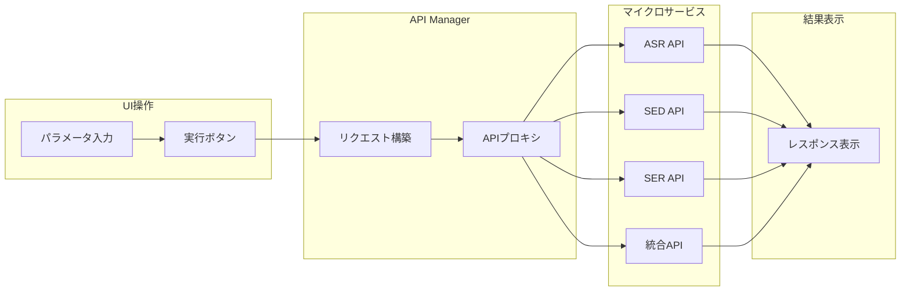
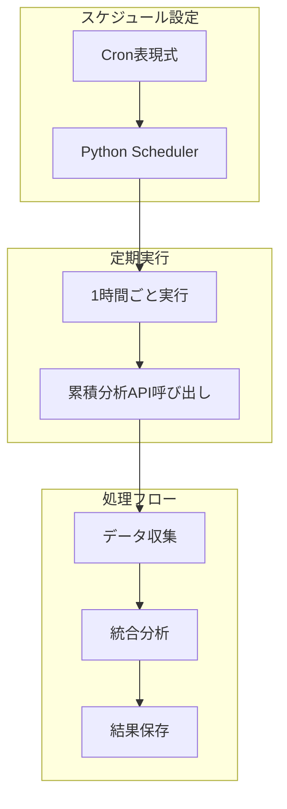

# WatchMe API Manager & Scheduler

## 📊 システム概要

API Managerは、WatchMeプラットフォームの全マイクロサービスを統合管理・実行するWebアプリケーションです。手動実行、スケジュール管理、処理状況モニタリングを一元的に提供します。

### 🎯 2つの実行モード

| 実行モード | トリガー方式 | 実行頻度 | 管理方法 | 用途 |
|-----------|------------|---------|---------|------|
| **手動実行** | Web UI操作 | 任意 | API Manager UI | テスト・再処理・個別実行 |
| **自動実行** | Cronスケジューラー | 設定による | Python Scheduler | 定期的な累積分析・バッチ処理 |

### 🔧 3つの管理機能

| 機能 | 説明 | アクセス方法 |
|------|------|------------|
| **API実行管理** | 全APIの手動実行とパラメータ設定 | `/` (ダッシュボード) |
| **スケジュール管理** | Cronベースの自動実行設定 | `/schedules` |
| **音声ファイル管理** | 録音ファイルの一覧・再生・ダウンロード | `/audio` |

### 🌐 アクセス情報

| 環境 | URL | 用途 |
|------|-----|------|
| **本番環境** | https://api.hey-watch.me/manager | プロダクション運用 |
| **開発環境** | http://localhost:9001 | ローカル開発・テスト |
| **GitHub** | [hey-watchme/api-manager](https://github.com/hey-watchme/api-manager) | ソースコード |

---

## 🔄 API構成

### マイクロサービス一覧

| カテゴリ | サービス名 | コンテナ名 | ポート | エンドポイント | メソッド |
|---------|-----------|-----------|--------|---------------|---------|
| **ASR** | Azure ASR | `vibe-transcriber-v2` | 8013 | `/fetch-and-transcribe` | POST |
| **統合** | プロンプト生成 | `api_gen_prompt_mood_chart` | 8009 | `/generate-mood-prompt-supabase` | **GET** |
| **統合** | スコアリング | `api-gpt-v1` | 8002 | `/analyze-vibegraph-supabase` | POST |
| **SED** | 音響イベント検出 | `sed-api` | 8004 | `/fetch-and-process-paths` | POST |
| **SED** | 行動集計 | `api-sed-aggregator` | 8010 | `/analysis/sed` | POST |
| **SER** | 感情特徴抽出 | `opensmile-api` | 8011 | `/process/emotion-features` | POST |
| **SER** | 感情集計 | `opensmile-aggregator` | 8012 | `/analyze/opensmile-aggregator` | POST |

### データ処理パターン

| パターン | 入力形式 | 使用API | 説明 |
|---------|---------|---------|------|
| **ファイルベース** | `file_paths[]` | ASR, SED, SER | 個別ファイルを直接処理 |
| **デバイスベース** | `device_id + date` | 集計・統合API | デバイス単位で日次処理 |
| **タイムブロック** | `device_id + date + time_block` | ダッシュボード | 30分単位の詳細処理 |

---

## 📋 主要機能詳細

### 1️⃣ API実行管理機能



**特徴**:
- 全APIを統一UIから実行
- パラメータのバリデーション
- リアルタイムレスポンス表示
- エラーハンドリング

### 2️⃣ スケジューラー機能



**現在のスケジュール**:

| ジョブ名 | 実行頻度 | 実行時刻 | 処理内容 |
|---------|---------|---------|---------|
| 累積分析 | 1時間ごと | 毎時00分 | dashboard_summary更新 |
| 日次集計 | 1日1回 | 深夜2:00 | 前日データの完全処理 |

### 3️⃣ 音声ファイル管理機能

**機能一覧**:

| 機能 | 説明 | 技術 |
|------|------|------|
| **ファイル一覧** | 50件ずつのページング表示 | React + VaultAPI |
| **フィルタリング** | デバイス・日付・ステータスで絞り込み | 複合クエリ |
| **音声再生** | ブラウザ内で直接再生 | HTML5 Audio + 署名付きURL |
| **ダウンロード** | ローカル保存 | S3プリサインドURL |

---

## 🏗️ アーキテクチャ

### システム構成

```
┌─────────────────────────────────────────┐
│          Web Browser (User)             │
└─────────────────────────────────────────┘
                    ↓
┌─────────────────────────────────────────┐
│      API Manager Frontend (React)        │
│         - Port: 9001 (dev)              │
│         - /manager (prod)               │
└─────────────────────────────────────────┘
                    ↓
┌─────────────────────────────────────────┐
│    API Manager Backend (Python/Flask)    │
│         - Port: 9002                    │
│         - Scheduler Service             │
└─────────────────────────────────────────┘
                    ↓
┌─────────────────────────────────────────┐
│        Microservices (EC2)              │
├──────────┬──────────┬──────────┬────────┤
│   ASR    │   SED    │   SER    │ 統合   │
│  :8013   │  :8004   │  :8011   │ :8009  │
└──────────┴──────────┴──────────┴────────┘
```

### エンドポイント階層

| レベル | エンドポイント例 | 用途 | アクセス元 |
|--------|---------------|------|-----------|
| **L1: UI** | `/psychology/azure-transcriber` | UIルーティング | ブラウザ |
| **L2: Backend** | `/api/execute` | API実行プロキシ | Frontend |
| **L3: Service** | `/fetch-and-transcribe` | 実際の処理 | Backend |

---

## 🚀 デプロイメント

### 🔄 自動デプロイ（CI/CD）

**2025年9月23日より、GitHub Actionsによる自動デプロイに移行しました。**

#### デプロイ方法
`main`ブランチにプッシュすると自動的にデプロイされます：

```bash
git push origin main
```

#### デプロイフロー
1. **GitHub Actions**が自動的に起動
2. **Dockerイメージ**のビルド
3. **Amazon ECR**へのプッシュ
4. **EC2インスタンス**での自動更新

#### 対象コンポーネント
- **Frontend**: `src/`、`public/`、`package.json`などの変更時
- **Backend/Scheduler**: `scheduler/`、`requirements.txt`の変更時

詳細は [CI/CD設定ガイド](./CI_CD_SETUP.md) を参照してください。

### 開発環境セットアップ

```bash
# リポジトリのクローン
git clone git@github.com:hey-watchme/api-manager.git
cd api-manager

# 依存関係のインストール
npm install

# 開発サーバー起動
npm run dev  # http://localhost:9001
```

### 環境変数設定

```bash
# .env ファイル
VITE_SUPABASE_URL=https://qvtlwotzuzbavrzqhyvt.supabase.co
VITE_SUPABASE_KEY=your-supabase-anon-key
VITE_API_BASE_URL=http://localhost:9002  # 開発
VITE_VAULT_API_BASE_URL=https://api.hey-watch.me  # 本番
```

---

## 📊 パフォーマンス指標

### レスポンスタイム

| API種別 | 平均応答時間 | タイムアウト設定 |
|---------|------------|--------------|
| ASR | 15-30秒 | 10分 |
| SED/SER | 10-20秒 | 3分 |
| 集計API | 5-10秒 | 1分 |
| 統合API | 10-15秒 | 1分 |

### システム負荷

| コンポーネント | CPU使用率 | メモリ使用量 | 備考 |
|---------------|----------|------------|------|
| Frontend | 〜5% | 〜200MB | React SPA |
| Backend | 〜10% | 〜500MB | Flask + Scheduler |
| Scheduler Jobs | 〜20% | 〜1GB | 実行時のみ |

---

## 🔒 セキュリティ

### アクセス制御

| 項目 | 実装 | 説明 |
|------|------|------|
| **認証** | 未実装 | 将来的にAuth0/Supabase Auth検討 |
| **CORS** | 設定済み | 開発環境はプロキシ、本番は同一ドメイン |
| **署名付きURL** | 実装済み | S3ファイルアクセスは1時間有効 |
| **APIキー** | 環境変数 | .envファイルで管理 |

---

## 📝 メンテナンス

### ログ確認

```bash
# Frontend ログ
docker logs api-manager-frontend

# Backend ログ  
docker logs api-manager-backend

# スケジューラーログ
docker logs api-manager-backend | grep SCHEDULER
```

### よくあるトラブル

| 問題 | 原因 | 対処法 |
|------|------|--------|
| API接続エラー | ネットワーク設定 | docker-networkを確認 |
| スケジュール未実行 | Scheduler無効 | SCHEDULER_ENABLED=true確認 |
| CORS エラー | プロキシ設定 | vite.config.js確認 |

---

## 🎯 今後の改善計画

### Phase 1: 認証機能（優先度: 高）
- [ ] ユーザー認証の実装
- [ ] ロールベースアクセス制御

### Phase 2: モニタリング強化（優先度: 中）
- [ ] リアルタイムログビューア
- [ ] 処理統計ダッシュボード
- [ ] アラート機能

### Phase 3: スケーラビリティ（優先度: 低）
- [ ] 複数インスタンス対応
- [ ] ジョブキューシステム
- [ ] 負荷分散

---

*最終更新: 2025年9月23日 - CI/CD自動デプロイに移行*